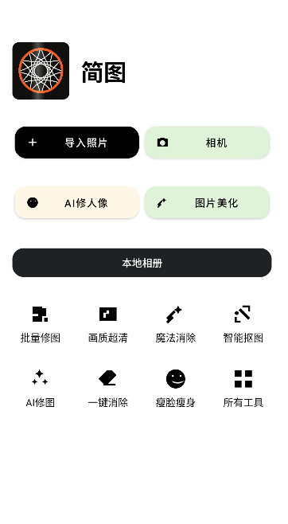
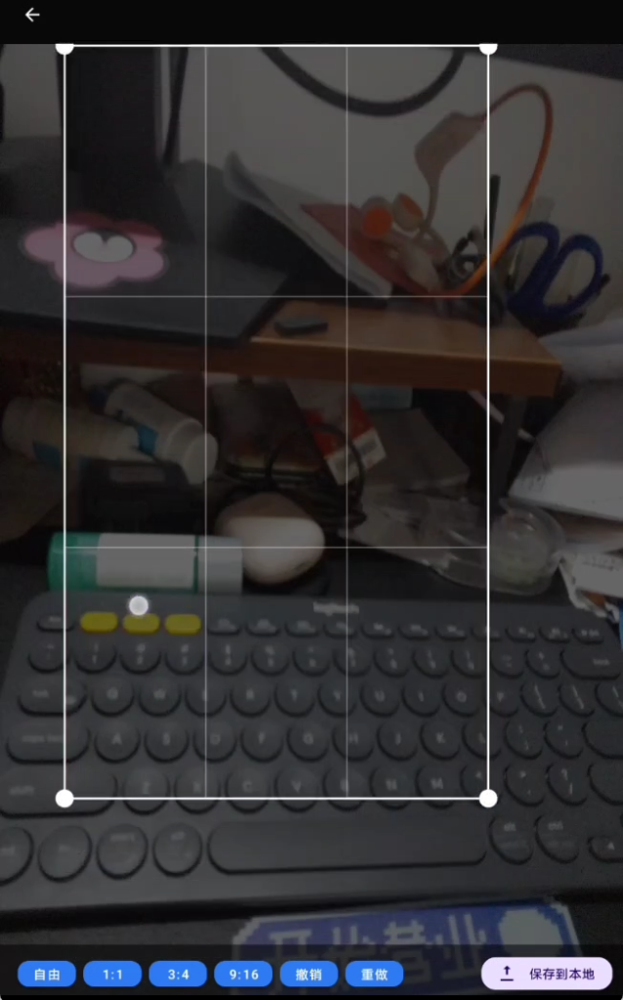

# MiniImageEditor

一款从零搭建的“小型修图 App”，包含首页、相册、编辑器与导出。技术栈覆盖 Kotlin、Jetpack、MediaStore、OpenGL ES 2.0、协程、Room、R8 混淆，并已接入 CameraX 拍照与 ExoPlayer 视频预览。

**核心功能截图**
- 首页（品牌位 + 主按钮 + 工具网格）：
  - 
- 编辑器（深色工作区 + 画布 + 底部工具条 + 裁剪框）：
  - 

## 功能概览
- 首页：原生控件搭建；自定义扫光视图 `ShimmerImageView`。
- 相册：MediaStore 异步拉取图片/视频缩略图，视频显示播放符号与时长角标。
- 编辑器：OpenGL ES 着色器管线渲染纹理，支持捏合缩放（焦点跟随）与单指平移；裁剪框拖拽与固定比例（自由/1:1/3:4/9:16）；撤销/重做。
- 导出：将编辑操作与裁剪结果应用到原图，保存 PNG 至 `Pictures/MiniEdit`。
- 拍照与视频：CameraX 拍照保存到相册；ExoPlayer 播放相册视频。

## 构建与运行
- 环境准备
  - 安装 Android Studio（2023.1+），SDK Platform 34/36，Build-Tools 34.x+；JDK 17。
  - 导入目录：`android/miniimageeditor`。
- 调试运行
  - 选择 `app` 模块，点击 Run；首页→相册→编辑→导出完整流程可运行。

## 适配与权限
- Android 13+ 使用 `READ_MEDIA_IMAGES/VIDEO`；Android 12- 使用 `READ_EXTERNAL_STORAGE`。
- 使用 MediaStore 读写，避免直写外部存储；权限失败提供提示与重试（各厂商弹窗差异可通过设置引导增强）。

## 技术实现
- 主页与相册：`RecyclerView` 网格 + `Material` 按钮；Coil 支持 GIF/WebP；视频缩略图播放符号与时长角标。
- OpenGL 编辑器：顶点/片元着色器绘制四边形纹理，MVP 矩阵实现缩放与平移；捏合按焦点缩放并校正平移；裁剪框叠层交互与导出映射；撤销/重做基于状态快照快速恢复。
- 协程与 Jetpack：`ViewModel` + `StateFlow` 驱动异步加载；Room 记录导出历史。
- 混淆：`app/proguard-rules.pro` 保留 OpenGL/Room/Coil 必要类。

## 排错与性能
- 日志标签：`MediaRepo`、`Album`、`Editor`；使用 Logcat 过滤。
- Profiler：检查编辑器缩放/平移时 CPU 与内存峰值；必要时启用大图采样解码与纹理复用。

## 项目报告（摘要）
- 设计取舍：优先打通“选图→编辑→导出”主链路；编辑器着色器管线采用简化 MVP 以保证易用性与可维护性。
- 难点与解决：
  - 权限与 MediaStore 适配：区分 33+ 与旧版权限；统一保存到标准相册路径，降低机型差异。
  - OpenGL 坐标与裁剪映射：屏幕坐标到原图像素反映射，捏合缩放引入焦点 NDC 修正保持手感稳定；保留将裁剪移至 GPU 纹理坐标反变换的升级空间。
  - 视频预览：使用 Media3 ExoPlayer，复用相册跳转逻辑，保证播放链路简单稳定。
- 后续规划：接入 CameraX 高级能力（对焦/曝光/网格）、精确裁剪坐标反变换、完整工具栏与滑杆参数面板、AI 人像优化模块。

## 目录索引
- 主页：`app/src/main/java/com/example/miniimageeditor/MainActivity.kt`
- 相册：`app/src/main/java/com/example/miniimageeditor/AlbumActivity.kt`
- 媒体库：`app/src/main/java/com/example/miniimageeditor/media/MediaStoreRepository.kt`
- 编辑器：`app/src/main/java/com/example/miniimageeditor/EditorActivity.kt`、`app/src/main/java/com/example/miniimageeditor/gl/ImageEditorRenderer.kt`
- 自定义视图：`app/src/main/java/com/example/miniimageeditor/ui/ShimmerImageView.kt`、`ui/CropOverlayView.kt`
- 混淆：`app/proguard-rules.pro`

